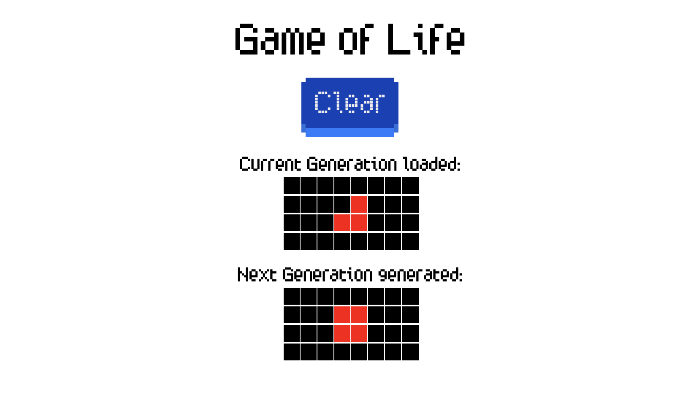

# Game Of Life

This code kata is based on [Conway's Game of Life](https://en.wikipedia.org/wiki/Conway%27s_Game_of_Life)

## Getting start

The project is realized in React (v17.0.2) + Typescript.

Download it, run `npm i` and after the installation is completed run `npm start`.

[Here](./game-of-life-test.txt) you can download the file you will need later and upload it to the app.

## How it's work

Once you have launched the app, you will see a button where you can upload the previously downloaded file. Once you have loaded the file, you will see two matrices appear on the screen, the first representing the output of the file, and the other representing the next generation of the file.

The file must be write in this format and the extension must be `.txt`, otherwise the file will be invalid:

```
Generation 3:
4 8
........
....*...
...**...
........
```

Of course you can change the text, for example:

```
Generation 2:
7 10
..........
....*.....
...**.....
....*.....
..........
..........
..........
```

## Screenshot

This is the first screen of the app that allows you to upload a file


This is the second screen of the app where it shows you the current generation (inserted from the file) and the next generation  


## Problem description

Given a input generation the goal of this kata is to calculate the next generation.
The world consists of a two dimensional grid of cells, where each cell is either dead or alive.

**For the purpose of this kata let's assume that the grid is finite and no life can exist off the edges**.

Given a cell we define its eight _neighbours_ as the cells that are horizontally, vertically, or diagonally adjacent.

When calculating the next generation you should follow these rules:

1. Any live cell with fewer than two live neighbours dies.
2. Any live cell with two or three live neighbours lives on to the next generation.
3. Any live cell with more than three live neighbours dies.
4. Any dead cell with exactly three live neighbours becomes a live cell.

## Solution implementation

The initial state (the current generation) will be provided via a text file that specifies:

- the current generation number
- the grid size
- the population state (`*` represents a live cell, `.` represents a dead cell)

In the following input file example we can see an input file specifying the third generation on a 4 by 8 grid:

```
Generation 3:
4 8
........
....*...
...**...
........
```

The output should display the correct number of the resulting generation, the grid size (this will always be the same as the one specified in the input file) and the current population state.
Given the example above, the expected output would be this:

```
Generation 4:
4 8
........
...**...
...**...
........
```

## Notes

- Implement the requirements focusing on **writing the best code you can produce**.
- When ready share with us a git repo (github/gitlab) with your solution.
- Feel free to provide a console application, web application, whatever!
